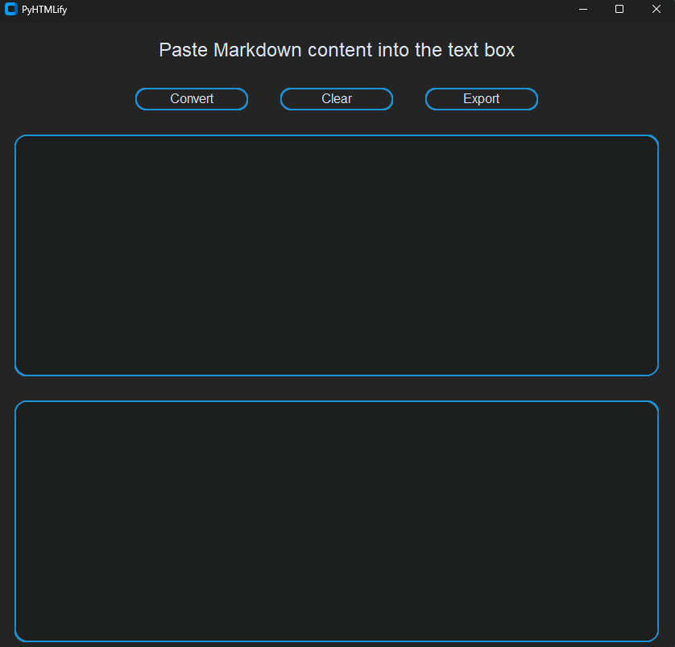

<h1 align="center">PyHTMLify</h1>

<p align="center">
  
  
</p>

PyHTMLify simplifies the process of converting Markdown text to HTML through an intuitive Python script and easy to use interface.

## Features

- **Graphical Interface:** User-friendly window to seamlessly convert Markdown text into HTML.
- **Headings Support:** Convert Markdown headings to HTML headings.
- **Lists Support:** Convert Markdown (ordered & unordered) lists to HTML lists.
- **Masked Links Support:** Convert Markdown masked links to HTML masked links.
- **HTML Output Exporter:** Export your HTML content with ease.

## Installation

### Prerequisites

> [!NOTE]\
> Ensure you have Python installed on your system. You can download Python from [python.org](https://www.python.org/).

### Installation Steps

1. Clone the repository and navigate to the project directory:
    ```bash
    git clone https://github.com/ImDarkLaw/PyHTMLify.git
    cd PyHTMLify   
    ```

2. Install the required dependencies using pip:
    ```bash
    pip install -r requirements.txt
    ```

## Usage

1. Run the script:
    ```bash
    python src/ui.py
    ```
   

2. Use the integrated text box to input Markdown content.
3. Click the "Convert" button to generate HTML output.
4. Export the HTML content using the "Export" button.

## License

PyHTMLify is licensed under the permissive MIT license. Please see [`LICENSE.txt`](https://github.com/ImDarkLaw/PyHTMLify/blob/main/LICENSE) for more info.